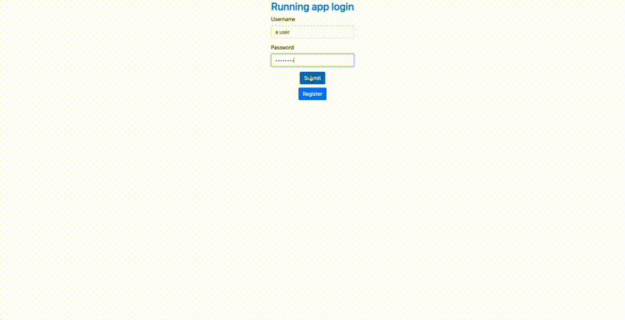
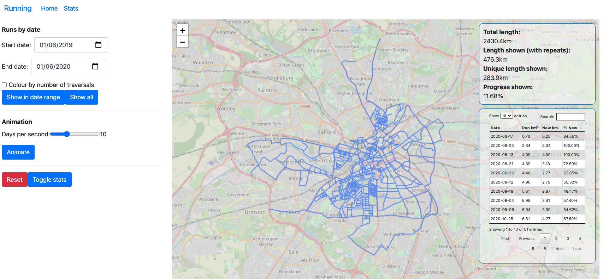

# Running app

## Summary

This app allows creation of running challenges that let you track progress towards running along all roads in a given area. OpenStreetMap (OSM) data is used to define roads included and the overall target distance. Since using OSM tags can result in roads that you wouldn't want to/can't run, there is an update map feature which can be used remove roads from the challenge e.g. private driveways.

## Usage

There are two ways to run the app:

* Installing the dependencies in `requirements.txt` into a Python virtual environment and using `make run-local`.
* Via Docker using `make start`. Volumes have not been set up yet so database changes will not persist upon terminating the container!

## Examples

In order to start a challenge you need to select an area:

Once you've selected an area you can log runs and view your statistics:

## History

The first version of this app was originally created during the first Covid lockdown when I decided to try and run all of the roads within the [M60](https://en.wikipedia.org/wiki/M60_motorway_(Great_Britain)) around Manchester.

As of mid 2022, having run ~40% of the challenge distance of ~2400km it's become much harder for me to run new roads since I've exhausted almost all roads within running distance of my house!

Here's a picture of the stats page from an earlier version of the app:

And here's another more recent (August 2022) picture:

## Technical notes

OSM data is retrieved using the [osmnx](https://github.com/gboeing/osmnx) Python package. Routing and map matching is done using that data, which is stored in a SQLite database. A more scalable solution to support lots of users might be to load OSM data on the fly and use something like [OSRM](http://project-osrm.org/) for routing. How to deal with OSM segment updates is another question though, ditto supporting specifying segments in a challenge.

The login functionality is rudimentary and whose main goal was for me to learn how to implement authentication in FastAPI, which is used for the backend. In particular you should change SECRET_KEY in `src/auth.py` using the command in the preceding comment and set it as an environment variable.

If I was starting this from scratch I would use a framework like React for the frontend, but one isn't used right now.
